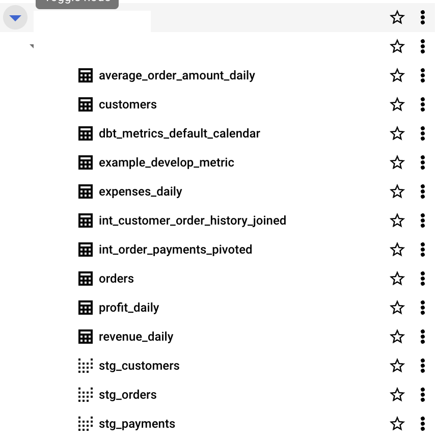
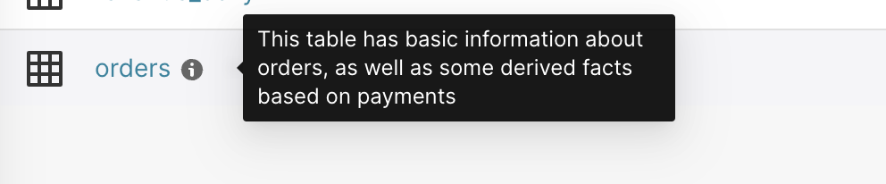
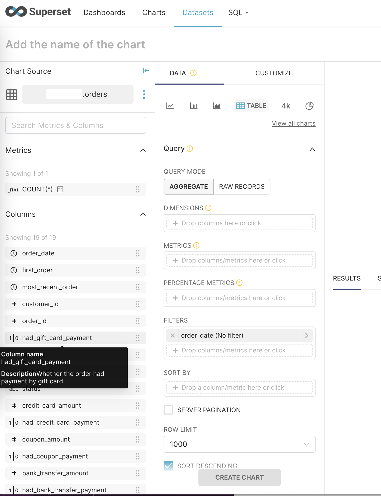

# Superset dbt demo

This repository contains an example project (Jaffle Shop) demonstrating integration between Superset and dbt, with BigQuery as the data warehouse.

## Setup

### Pre-requisities

- Python 3.11
  - [dbt-core does not work with 3.12.x](https://github.com/dbt-labs/dbt-core/issues/9007#issuecomment-1854738180).
- [Poetry](https://python-poetry.org/docs/#installation)
- A Kubernetes cluster (and `helm` installed)   

### Steps

#### Installing Superset

We'll be following the steps from [Running Superset on Kubernetes](https://superset.apache.org/docs/installation/running-on-kubernetes#running) to install Superset locally. If you prefer installing/running it via other methods (using pip or docker compose), you're free to do so.

1. Add the Superset helm repository with the following command:

    ```bash
    $ helm repo add superset https://apache.github.io/superset
    ```

1. Set `SECRET_KEY` in `helm/superset-values.yaml`. Use `openssl rand -base64 42` to generate a key.
1. Install and run
    ```bash
    $ helm upgrade --install --values --debug helm/superset-values.yaml superset superset/superset
    ```

1. Visit http://localhost:8088

#### Installing Python dependencies

1. Run `poetry install` in the root directory.
1. Use `poetry shell` to spawn a shell within the virtual environment.
1. Run `dbt --version` to ensure the version is `1.5.x`.
1. Run `dbt deps` to install some dbt dependencies needed.
    ```
    $ cd dbt_jaffle_shop
    $ dbt deps
    ```

#### BigQuery setup (Configuring `profiles.yml`)

1. Create a BigQuery service account (with BigQuery admin access) and generate a JSON credentials key for it. Replace `PATH_TO_KEYFILE` in `dbt_jaffle_shop/profiles.yml` with the downloaded JSON file path.
    > [!NOTE]
    > We'll be using the same credentials file for `dbt` (to run materialization jobs) and for `Superset` (to run queries against BQ tables). In the real world, these will likely exist as separate credentials and scoped down to the specific permissions required.
1. Create a BigQuery dataset with the default options (or use an existing one). Replace `BIGQUERY_DATASET` with the name.
1. Replace `GCP_PROJECT` with the name of your GCP project.


## Running the demo

### Materialize assets into BQ and view dbt docs site

1. Materialize assets described in the `dbt_jaffle_shop/models/` directory
    ```bash
    $ cd dbt_jaffle_shop
    $ dbt run
    ```
    <details>
    <summary>Example logs from `dbt run`</summary>

        $ dbt run
        23:47:38  Running with dbt=1.5.9
        23:47:38  Registered adapter: bigquery=1.5.7
        23:47:38  Unable to do partial parsing because profile has changed
        23:47:39  Found 12 models, 36 tests, 0 snapshots, 4 analyses, 587 macros, 0 operations, 0 seed files, 0 sources, 0 exposures, 4 metrics, 0 groups
        23:47:39
        23:47:40  Concurrency: 1 threads (target='dev')
        23:47:40
        23:47:40  1 of 12 START sql view model my_dataset.stg_customers .......................... [RUN]
        23:47:41  1 of 12 OK created sql view model my_dataset.stg_customers ..................... [CREATE VIEW (0 processed) in 1.20s]
        23:47:41  2 of 12 START sql view model my_dataset.stg_orders ............................. [RUN]
        23:47:44  2 of 12 OK created sql view model my_dataset.stg_orders ........................ [CREATE VIEW (0 processed) in 2.42s]
        23:47:44  3 of 12 START sql view model my_dataset.stg_payments ........................... [RUN]
        23:47:45  3 of 12 OK created sql view model my_dataset.stg_payments ...................... [CREATE VIEW (0 processed) in 1.34s]
        23:47:45  4 of 12 START sql table model my_dataset.dbt_metrics_default_calendar .......... [RUN]
        23:47:51  4 of 12 OK created sql table model my_dataset.dbt_metrics_default_calendar ..... [CREATE TABLE (14.6k rows, 0 processed) in 6.40s]
        23:47:51  5 of 12 START sql table model my_dataset.int_customer_order_history_joined ..... [RUN]
        23:47:59  5 of 12 OK created sql table model my_dataset.int_customer_order_history_joined  [CREATE TABLE (100.0 rows, 4.3 KiB processed) in 7.65s]
        23:47:59  6 of 12 START sql table model my_dataset.int_order_payments_pivoted ............ [RUN]
        23:48:08  6 of 12 OK created sql table model my_dataset.int_order_payments_pivoted ....... [CREATE TABLE (99.0 rows, 6.7 KiB processed) in 8.80s]
        23:48:08  7 of 12 START sql table model my_dataset.example_develop_metric ................ [RUN]
        23:48:08  WARNING: dbt_metrics is going to be deprecated in dbt-core 1.6 in July 2023 as part of the migration to MetricFlow. This package will continue to work with dbt-core 1.5 but a 1.6 version will not be released. If you have any questions, please join us in the #dbt-core-metrics in the dbt Community Slack
        23:48:12  7 of 12 OK created sql table model my_dataset.example_develop_metric ........... [CREATE TABLE (4.0 rows, 229.8 KiB processed) in 4.67s]
        23:48:12  8 of 12 START sql table model my_dataset.orders ................................ [RUN]
        23:48:18  8 of 12 OK created sql table model my_dataset.orders ........................... [CREATE TABLE (99.0 rows, 11.9 KiB processed) in 5.56s]
        23:48:18  9 of 12 START sql table model my_dataset.average_order_amount_daily ............ [RUN]
        23:48:18  WARNING: dbt_metrics is going to be deprecated in dbt-core 1.6 in July 2023 as part of the migration to MetricFlow. This package will continue to work with dbt-core 1.5 but a 1.6 version will not be released. If you have any questions, please join us in the #dbt-core-metrics in the dbt Community Slack
        23:48:23  9 of 12 OK created sql table model my_dataset.average_order_amount_daily ....... [CREATE TABLE (77.0 rows, 116.7 KiB processed) in 5.38s]
        23:48:23  10 of 12 START sql table model my_dataset.expenses_daily ....................... [RUN]
        23:48:23  WARNING: dbt_metrics is going to be deprecated in dbt-core 1.6 in July 2023 as part of the migration to MetricFlow. This package will continue to work with dbt-core 1.5 but a 1.6 version will not be released. If you have any questions, please join us in the #dbt-core-metrics in the dbt Community Slack
        23:48:28  10 of 12 OK created sql table model my_dataset.expenses_daily .................. [CREATE TABLE (55.0 rows, 117.7 KiB processed) in 5.06s]
        23:48:28  11 of 12 START sql table model my_dataset.profit_daily ......................... [RUN]
        23:48:28  WARNING: dbt_metrics is going to be deprecated in dbt-core 1.6 in July 2023 as part of the migration to MetricFlow. This package will continue to work with dbt-core 1.5 but a 1.6 version will not be released. If you have any questions, please join us in the #dbt-core-metrics in the dbt Community Slack
        23:48:33  11 of 12 OK created sql table model my_dataset.profit_daily .................... [CREATE TABLE (55.0 rows, 117.7 KiB processed) in 4.54s]
        23:48:33  12 of 12 START sql table model my_dataset.revenue_daily ........................ [RUN]
        23:48:33  WARNING: dbt_metrics is going to be deprecated in dbt-core 1.6 in July 2023 as part of the migration to MetricFlow. This package will continue to work with dbt-core 1.5 but a 1.6 version will not be released. If you have any questions, please join us in the #dbt-core-metrics in the dbt Community Slack
        23:48:37  12 of 12 OK created sql table model my_dataset.revenue_daily ................... [CREATE TABLE (55.0 rows, 117.7 KiB processed) in 4.48s]
        23:48:37
        23:48:37  Finished running 3 view models, 9 table models in 0 hours 0 minutes and 58.75 seconds (58.75s).
        23:48:37
        23:48:37  Completed successfully
        23:48:37
        23:48:37  Done. PASS=12 WARN=0 ERROR=0 SKIP=0 TOTAL=12

    </details>

1. Verify that the tables/views have been populated in your BQ dataset. It should look like the screenshot below:
<p align="center">
    
</p>

1. Browse generated dbt docs

    ```
    $ dbt docs generate
    $ dbt docs serve
    ```


### Connect Superset to BQ

1. Visit your running Superset instance -> Settings -> Database Connections -> Click "+ Database". This should open up a modal.
1. Choose "Google BigQuery" in the list of supported databases.
1. Upload the earlier generated service account credentials JSON file
1. Hit "Connect"

### Add datasets to Superset

> [!NOTE]
> In Superset, "datasets" can be created from database tables or SQL queries. In BigQuery, a dataset is a collection of tables and views.

1. Go to the "New dataset" page from the "Datasets" tab
1. Choose "Google BigQuery" as the database (or whatever you named it)
1. Choose the schema (the "dataset" in BigQuery, bear with me here) and table. Let's choose `orders` as the table to create the Superset dataset for.
1. Hit "Create Dataset and Create Chart" (What if you _don't_ want to create a chart? Well, too bad.)

> [!TIP]
> At this point, you're free to create more datasets off of other BQ tables/views and play around with creating charts/dashboards. Continue on with the rest of this demo to see how you can sync dbt model/column descriptions into Superset.

### Push dbt model/column descriptions into Superset (using dbt-superset-lineage)

We'll be using the handy dandy [`dbt-superset-lineage`](https://github.com/slidoapp/dbt-superset-lineage). Since using `dbt-superset-lineage` requires you to export a Superset access token (to interact with its APIs), a wrapper script is provided in `dbt_jaffle_shop/push_descriptions.py` that fetches the access token and pushes descriptions. Tweak the Superset host/port/protocol in the script as needed.

```bash
# Drop into the virtualenv if you haven't already
$ poetry shell
# Push model descriptions from dbt into Superset
# Will only push descriptions for the `orders` model since that's the only dataset present
# in both Superset and dbt (if you're following this demo as is).
$ python3 dbt_jaffle_shop/push_descriptions.py
```

If the script ran successfully, you should be able to see the `orders` model description in Superset by hovering over the now-present information tooltip. Click on the dataset, and hover over any of the column names to see their descriptions as well.

<p align="center">
    
    
</p>


From their documentation,
> Using dbt-superset-lineage, you can:
>   - Add dependencies of Superset dashboards to your dbt sources and models
>   - Sync model and column descriptions from dbt docs to Superset

We'll be limiting the scope of this demo to the latter feature.

> [!TIP]
> Read [this blogpost](https://engineering.hometogo.com/how-hometogo-connected-dbt-and-superset-to-make-metadata-more-accessible-and-reduce-analytical-2223af539cc6) from the authors of `dbt-superset-lineage` for more on the motivation behind creating a dbt <-> Superset connector.

---

## Summary

- We setup the example Jaffle Shop dbt project to materialize tables/views into a BigQuery dataset.
- We installed Superset locally (via K8S/helm) and connected BigQuery as a data source.
- We were able to access dbt model/column descriptions in Superset.


### Further reading

- [Preset Cloud (Superset SaaS) integation with dbt Core](https://preset.io/blog/dbt-superset-integration-preset/)
- [Creating your first dashboard in Superset](https://superset.apache.org/docs/creating-charts-dashboards/creating-your-first-dashboard/)


With that, you've reached the end of this demonstration. Happy charting and dbt'ing!
